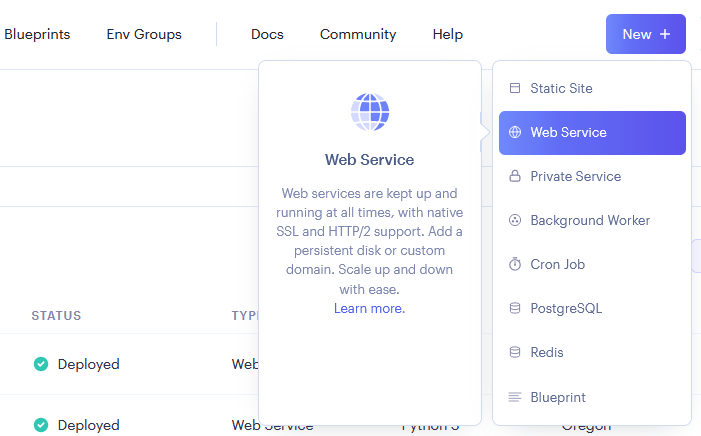
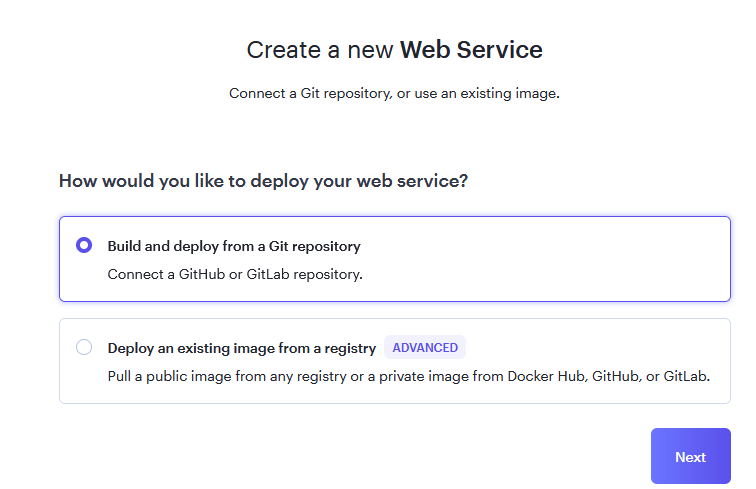
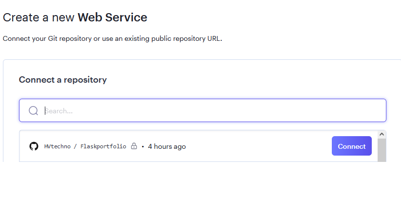
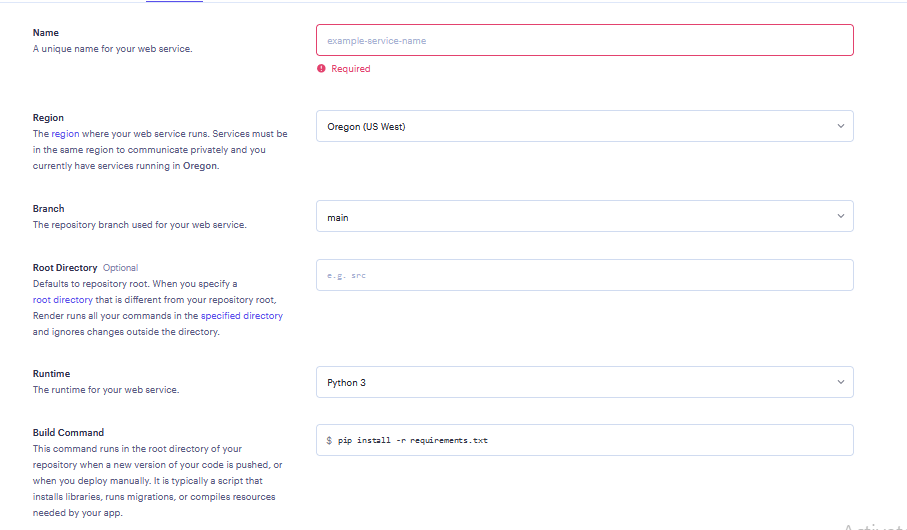
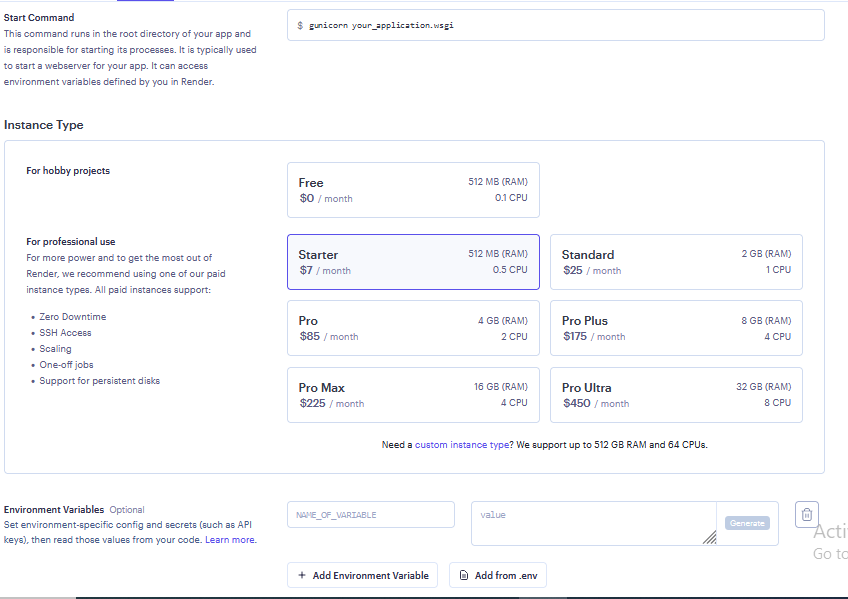
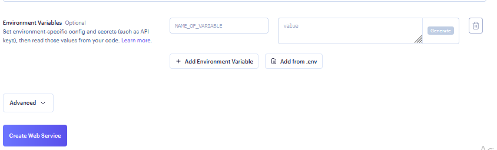

# Digital Portfolio Website with personal Chatbot using Flask

## Introduction
This repository provides the routeway on how you can make the digitized portfolio comprises of personal chatbot using Flask
The summary of this respository includes the process sections below
- **Portfolio**: Create Animated HTML page for Digital Website comprises of various sections (About, Skills, Education, Contact)
- **Chatbot**: Use Flask for routing the HTML pages along with some javascripts to fetch the data from backend. 
- **Deployment**: This project has been completly deployed on the cloud using Render platform and you can view the complete output here [Digital Portfolio](https://haridigicv.onrender.com)

## Procedure

**Step 1** - Install all the libraries from requirements file using below command.
This will install all the dependencies

```python
pip install -r requirements.txt
```

**Step 2** - In `app.py`, please provide all the possible values for all environment variables as defined
this project has been created to receive notifications from users on my gmail account.
so, if users want to reach out to me they can send the email on my gmail account through contact form.

please create your app password on your gmail account here, [Security](https://myaccount.google.com/security?)

```
SMTP Server: smtp.gmail.com
SMTP Port: 587
SMTP User: (Your Gmail app Username)
SMTP Password: (Your Gmail app Password)
SMTP Receiver: (The acount, where you want to receive emails from users)
```

**Step 3** - For Chatbot, create your own intents where user can get to know both professional and personally
and save it here `static/intents/data.json`

**Step 4** - train your model, by running the script below
this will save 2 files `classifier.pkl` & `vectorizer.pkl` on the folder `static/models`

```python
import json
import nltk
import random
import pickle
from nltk.stem import WordNetLemmatizer
from nltk.tokenize import word_tokenize
from sklearn.feature_extraction.text import TfidfVectorizer
from sklearn.svm import LinearSVC

# Load the intents data
with open('static/intents/data.json') as file:
    data = json.load(file)

# Initialize the lemmatizer
lemmatizer = WordNetLemmatizer()

# Initialize empty lists for documents and classes
documents = []
classes = []
text = []
intents = []

# Preprocess the data
for intent in data['intents']:
    for pattern in intent['patterns']:
        words = word_tokenize(pattern)
        words = [lemmatizer.lemmatize(word.lower()) for word in words if word.isalnum()]
        text.append(" ".join(words))
        intents.append(intent['tag'])
    if intent['tag'] not in classes:
        classes.append(intent['tag'])

vectorizer = TfidfVectorizer()
X = vectorizer.fit_transform(text)

y = [classes.index(intent) for intent in intents]

classifier = LinearSVC()
classifier.fit(X, y)

pickle.dump(vectorizer, open('static/models/vectorizer.pkl', 'wb'))
pickle.dump(classifier, open('static/models/classifier.pkl', 'wb'))

print("Model training completed.")
```

**Step 5** - Finally, run `app.py` by using below command if you are running in Development mode

```python
set FLASK_APP=app.py
set FLASK_ENV=development
flask run
```
## Render Deployment

Before, the deployment steps below i would highly recommand to get to know about render platform and its free usages by redirecting to this link 
[Render](https://render.com/)

**Step 1** - once you are sucecssfully, logged in to Render (I would suggest you can login with github account)
you could see the screenshot below. From this screen select create a `web service`





**Step 2** - Once you selected your web service, build and deploy your github repository as mentioned on the below screenshot





**Step 3** - Now, you can search and connect your repository, which you want to deploy and create webapp service





**Step 4** - Now, here you need to provide some of your informations, like `app Service name` 
and for `Region`, `Branch` & `Root Directory` & `Runtime` as it is shown on the screenshot if you are deploying python applications





**Step 5** - To start command with gunicorn to run your `app.py` use `$ gunicorn app:app` 
also, if your python file is `main.py`, use `$ gunicorn main:app`. then select the app service plan, please read about render and services before you choose instance type
specifically for this project, i would go for starter or higher because this project comprises of machine learning model
for chatbot

**NOTE - This project was initially developed with Tensorflow & keres for chatbot, however this models are not compatible to deploy in render and 
were failed due to huge memory issues and aborted. Then the project in this chatbot was redesigned with skicit-learn & NLTK to leverage the memory issues and 
were easlity to deploy in render.**





**Step 6** - Here you have the options to use environment variables. I would recommend to use this section below 
and include all the Varibales which you want to use & you can eaily call these values  in your applications
and call values 
Once you selected all the relevant options. Now you are ready to deploy your app service as shown below



